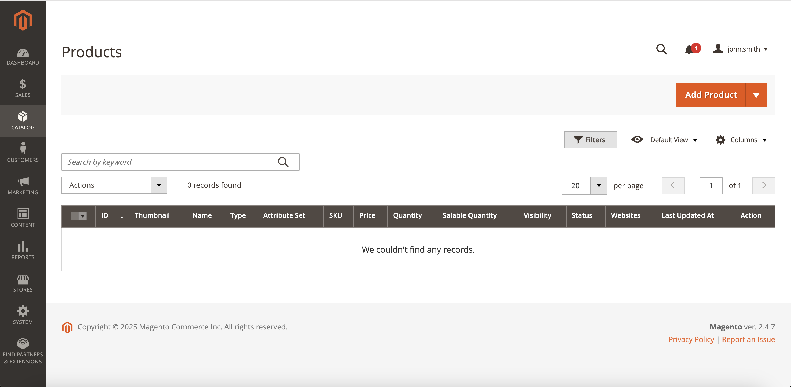
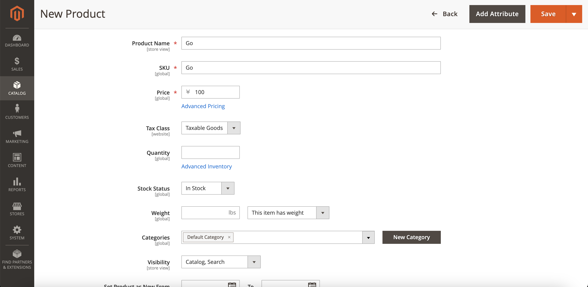
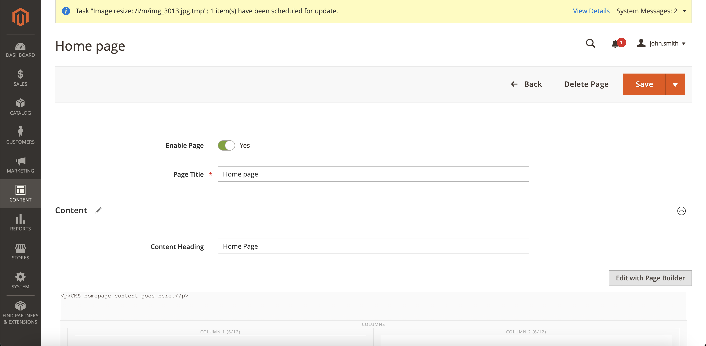

# 📌 Dev Setup

This document will guide you through setting up your machine to develop the module locally. The development environment is based off of [Mark Shust's docker configuration](https://github.com/markshust/docker-magento)

## 📌 Prerequisites

1. Have Docker or Podman installed on your local machine
2. Ensure your container runtime has enough resources to run properly (at least 4GB of RAM)
3. Have access to a [magento marketplace](https://marketplace.magento.com/) account

## 📌 Quick Start

1. Add `magento.test` to your hosts file: `echo '127.0.0.1 magento.test' | sudo tee -a /etc/hosts`
2. Open your browser and ready for your access key. [Link](https://commercemarketplace.adobe.com/customer/accessKeys/)
3. Open terminal, execute `./setup`
4. In the middle, please write your public key in `username`, your private key in `password`.
5. When the setup process finishes, open https://magento.test:8443
6. After setup process is done, you can start/stop with `./run` and `bin/stop` via terminal.

Please check [Setup Magento Store](#setup-magento-store)

## 📌 Set up Magento Account

Once you have a Magento account, you can create an access key [here](https://marketplace.magento.com/customer/accessKeys/). Once you have the public and private key you need to place them in the `~/.composer/auth.json`:

```json
{
  "http-basic": {
    "repo.magento.com": {
      "username": "public key goes here",
      "password": "private key goes here"
    }
  }
}
```

## 📌 Set up Ngrok

Because Komoju uses webhooks to alert systems to updates to the transactions, the dev environment needs to be publicly accessible on the internet. [Ngrok](https://ngrok.com/) is the easiest solution for this. If possible it's best to pick a static domain, so you won't have to manually change the address in Magento each time. Once you have a stable domain, start it with:

```bash
$ ngrok http 8443 --domain=your-domain.ngrok-free.app
```

## 📌 Customizing the Setup

The `./setup` script downloads Magento and configures the environment with sensible defaults. You can customize the Magento version and domain by editing the top-level `setup` script:

- **Magento version:** Change the version passed to `bin/download` (e.g., `bin/download 2.4.7 community`)
- **Domain:** `bin/setup` accepts a domain as its first argument (defaults to `magento.test`). If you are using Ngrok, pass your Ngrok domain instead:

```bash
$ bin/setup your-domain.ngrok-free.app
```

**NOTE:** After initial setup, you can use `./run` (`bin/start`) and `bin/stop` to start and stop the dev environment without re-running the full setup.

## 📌 Setup Magento Store

To set up the store to be able to test changes to the plugin you will need to have some items for sale as well as configuring the plugin to correctly communicate with Komoju. To do this you will first need to log into the admin page.

### 📌 Logging into the Admin Page

💡 Note: For this guide, we assume your Magento store is accessible at [https://magento.test:8443](https://magento.test:8443).

- Open [the admin page](https://magento.test:8443/admin)

Going to this page you will be prompted for admin credentials, which you can find in [ENV file](https://github.com/degica/komoju-magento/blob/master/env/magento.env)

### 📌 Adding Items to the Store

Once inside the admin page, click the "Catalog" option on the left menu and then click the "Add Product" button. Fill in the required fields as well as:

- **Categories:** Make sure the item has at least one category
- **Quantity:** Set to a large enough number you won't run out during testing (e.g., 1000)
- **Stock Status:** Set to "In Stock"

#### 📌 Setup Currency

Make sure store currency is set as JPY

  1. Set country as Japan in Store > Configuration > General. **Make sure allowed country includes Japan**
    

  2. Set currency as JPY in Store > Configuration > Currency Setup. **Make sure allowed currency includes JPY**
    

#### 📌 Step by step guide to add a product

  1. Go to Catalog > Products. Click **Add Product**
  
  2. Fill out the form. `Product Name`, `SKU`, `Price`, `Quantity` and `Category` should not be empty. Optionally, you can add an image for the product.
  
  3. Go to Content > Pages. Click **Action** > **Select** > **Edit** next to **Home page** (or page you want to edit)
  
  4. Click **Edit with Page Builder**
  
  5. Add **Columns** or **Row** by drag and dropping. Also add **Product**. Click Cog icon for Product.
  
  6. Set Category (Same as you setup for the product to show)
  
  7. Close by clicking right-top `x` button. Click **Save**.
  
  8. **Important** Run `./index` in the terminal to refresh the page.
  9. That's it! 
  

## 📌 Configure the Plugin

1. To configure the plugin, go to the admin page and click on "Stores" in the left menu, and then click on "Configuration" in the submenu.
2. Once on the Configuration page, there should be a "General" menu on the left, next to the main admin menu. Scroll down to the "Sales" section, expand it and click on "Payment Methods"
3. Click "Configure" next to Komoju to configure the plugin.
4. Update with the relevant Komoju account details
