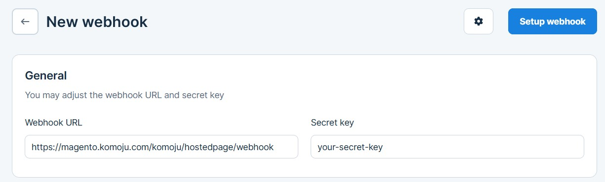

# KOMOJU-Magento Plugin Quick Start Guide

Enhance your Magento store with **KOMOJU**, the leading payment gateway for Japanese payment methods. Before proceeding, ensure you have:

- A [Adobe Commerce (Magento) account](https://business.adobe.com/products/magento/magento-commerce.html)
- A [KOMOJU account](https://komoju.com/)

---

## 📌 Installation Instructions

### Installing the Module Manually

1. **Download** the latest version of the module from the [GitHub release page](https://github.com/degica/komoju-magento/releases).
2. **Upload** the downloaded file to your Magento server.
3. **Unzip** the file directly into your `$MAGENTO_INSTALL/app/code` directory:

    ```bash
    unzip komoju-magento-release.zip -d $MAGENTO_INSTALL/src/app/code
    ```

    *(Replace `$MAGENTO_INSTALL` with your actual Magento install path.)*

4. **Install the new module** by running:

    ```bash
    php bin/magento setup:upgrade
    php bin/magento setup:di:compile
    php bin/magento cache:flush
    php bin/magento setup:static-content:deploy
    ```

---

## 📌 Configuring the Plugin

After installation, configure the plugin in your Magento admin panel:

1. **Navigate to**:  
   **Stores** > **Sales** > **Payment Methods** > **KOMOJU** > **API Settings**  
2. **Enter your KOMOJU account details** as found on your [KOMOJU merchant settings page](https://komoju.com/admin/merchant_settings).


### API Settings
- **Merchant UUID**: Your UUID  
- **Secret Key**: Secret Key  
- **Publishable Key**: Publishable Key  
- **Webhook Secret**: (See *Configuring the KOMOJU Webhook* below)


---

## 📌 Configuring the KOMOJU Webhook

1. **Go to** your [KOMOJU dashboard’s Webhook page](https://komoju.com/merchant/webhooks) and click **"New Webhook"**.
2. Set up a webhook from your KOMOJU dashboard. For example, if your Magento URL is https://magento.komoju.com, then your Webhook URL would be https://magento.komoju.com/komoju/hostedpage/webhook.

*(Replace `<your-magento-domain>` with your store’s actual domain.)*


3. **Choose a secret** and enable the following events:
- `payment.authorized`
- `payment.captured`
- `payment.expired`
- `payment.cancelled`
- `payment.refunded`
- `payment.refund.created`




4. **Create the Webhook**, then copy the **Webhook Secret**.
5. **Enter the Webhook Secret** in your Magento admin panel under **KOMOJU** > **API Settings** > **Webhook Secret**.

---

## 📌 Contact Us

If you have any questions or concerns, feel free to reach out to our support team at:  
[support@degica.com](mailto:support@degica.com)

---

*Thank you for choosing KOMOJU! We look forward to supporting your business growth.*