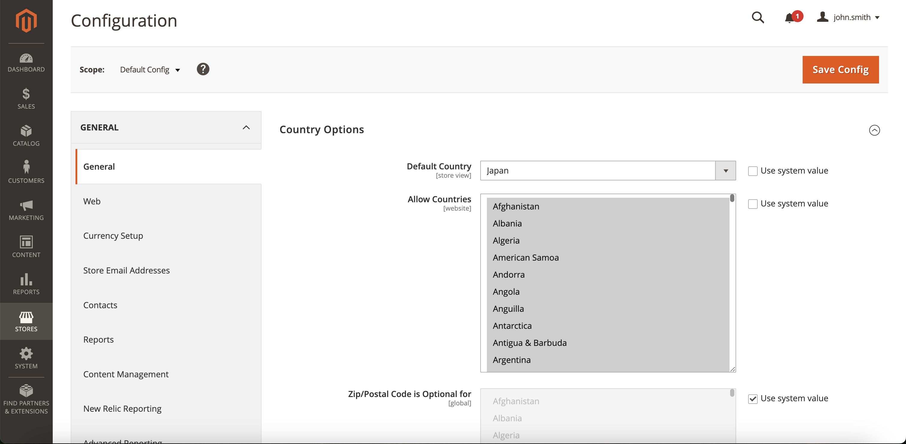
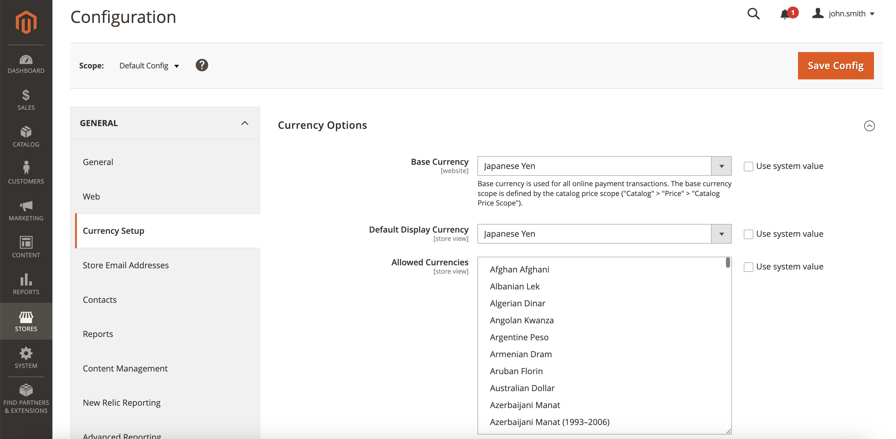
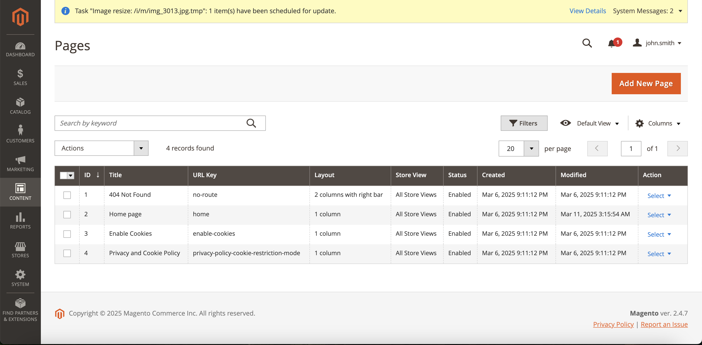
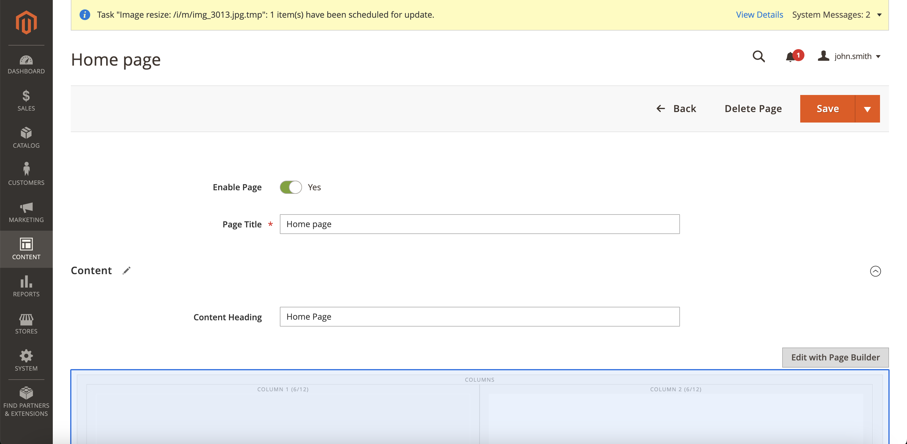
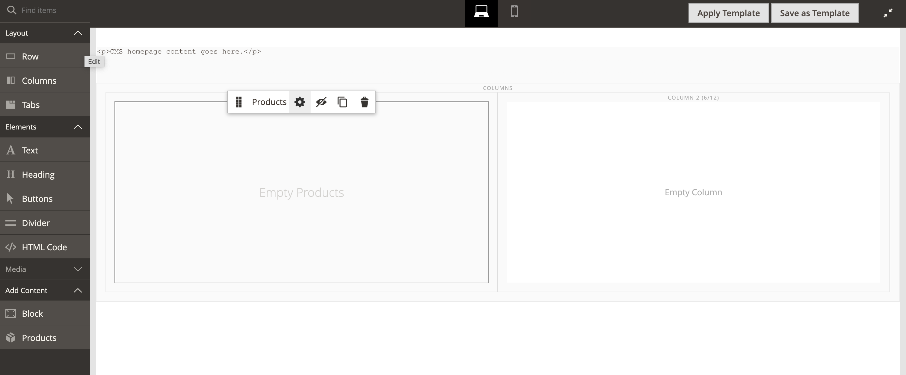
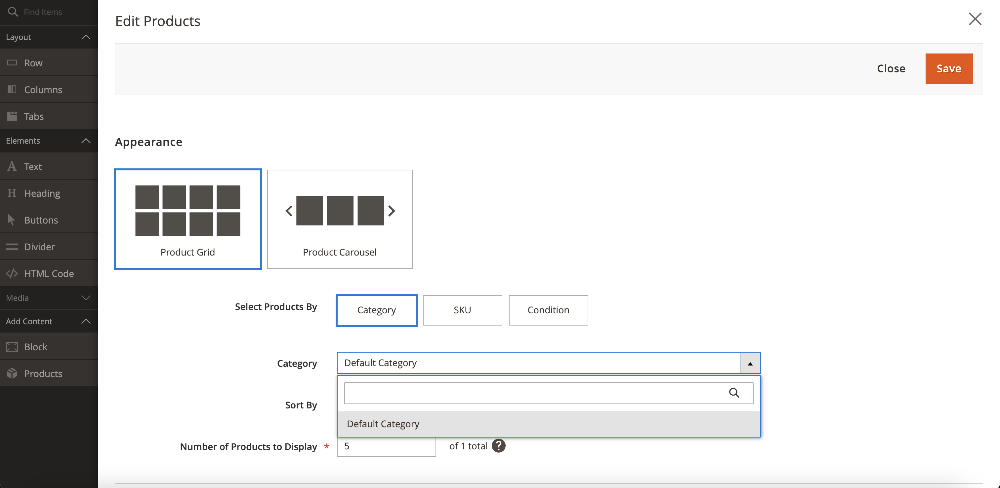
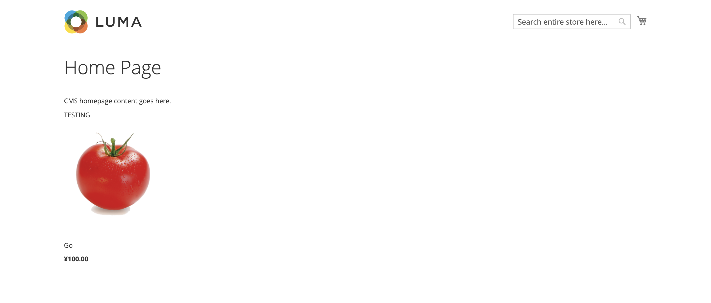

# 📌 開発環境のセットアップ

このドキュメントでは、ローカルマシンに開発環境をセットアップする手順を説明します。この開発環境は[Mark Shust氏のDocker設定](https://github.com/markshust/docker-magento)を基にしています。

## 📌 前提条件

1. DockerまたはPodmanがローカルマシンにインストールされていること。
2. コンテナランタイムに十分なリソースを割り当ててください（最低4GBのRAM）。
3. [Magento Marketplace](https://marketplace.magento.com/)のアカウントにアクセスできること。

## 📌 クイックスタート

1. hostsファイルに`magento.test`を追加してください: `echo '127.0.0.1 magento.test' | sudo tee -a /etc/hosts`
2. ブラウザでアクセスキーの準備をしてください。[リンクはこちら](https://commercemarketplace.adobe.com/customer/accessKeys/)
3. ターミナルを開き、`./setup`を実行します。
4. 途中で、公開鍵を`username`、秘密鍵を`password`として入力してください。
5. セットアップが終了したら、[https://magento.test:8443](https://magento.test:8443) を開いてください。
6. セットアップ後、`./run`で起動、`bin/stop`で停止できます。

詳しくは [Magentoストアのセットアップ](#magentoストアのセットアップ) をご覧ください。

## 📌 Magentoアカウントの設定

Magentoのアカウントを取得したら、[こちら](https://marketplace.magento.com/customer/accessKeys/)でアクセスキーを作成します。公開鍵と秘密鍵を取得したら、それを`~/.composer/auth.json`に設定します。

```json
{
  "http-basic": {
    "repo.magento.com": {
      "username": "公開鍵",
      "password": "秘密鍵"
    }
  }
}
```

## 📌 Ngrokの設定

Komojuは取引状況の更新をWebhookで通知するため、開発環境をインターネット上で公開する必要があります。そのための最も簡単な方法が[Ngrok](https://ngrok.com/)です。できれば固定のドメインを使うことをおすすめします（Magentoの設定を毎回変更しなくて済みます）。

安定したドメインを用意したら、以下のコマンドでNgrokを起動します。

```bash
$ ngrok http 8443 --domain=your-domain.ngrok-free.app
```

## 📌 セットアップのカスタマイズ

`./setup`スクリプトはMagentoのダウンロードと環境設定を行います。Magentoのバージョンやドメインは、トップレベルの`setup`スクリプトを編集することでカスタマイズできます。

- **Magentoバージョン:** `bin/download`に渡すバージョンを変更します（例: `bin/download 2.4.7 community`）
- **ドメイン:** `bin/setup`は第1引数としてドメインを受け取ります（デフォルトは`magento.test`）。Ngrokを使用する場合は、Ngrokドメインを指定してください:

```bash
$ bin/setup your-domain.ngrok-free.app
```

**注意:** 初回セットアップ後は、`./run`（`bin/start`）と`bin/stop`で開発環境の起動・停止ができます。フルセットアップを再実行する必要はありません。

## 📌 Magentoストアのセットアップ

プラグインの変更をテストするためには、商品を登録して販売可能にし、Komojuと正しく通信できるようプラグインを設定する必要があります。これにはまず管理画面にログインします。

### 📌 管理画面へのログイン

💡 注：このガイドでは、MagentoストアのURLは [https://magento.test:8443](https://magento.test:8443) と仮定しています。

- [管理画面](https://magento.test:8443/admin)を開きます。

ここで要求される管理者用の認証情報は[ENVファイル](https://github.com/degica/komoju-magento/blob/master/env/magento.env)に記載されています。

### 📌 ストアに商品を追加する

管理画面内で、左メニューの「Catalog」をクリックし、「Add Product」ボタンを押します。以下のフィールドも必ず設定してください。

- **Categories:** 商品には少なくとも1つカテゴリを指定
- **Quantity:** テスト中に在庫切れにならないように十分な数を設定（例: 1000）
- **Stock Status:** 「In Stock」に設定

#### 📌 通貨の設定

ストア通貨が **JPY（日本円）** に設定されていることを確認してください。

1. 管理画面で「ストア (Store) > 設定 (Configuration) > 一般 (General)」に移動し、国を「日本 (Japan)」に設定します。**許可された国に日本が含まれていることを必ず確認してください。**
  

2. 「ストア (Store) > 設定 (Configuration) > 通貨設定 (Currency Setup)」に移動し、通貨を「JPY（日本円）」に設定します。**許可された通貨にJPYが含まれていることを必ず確認してください。**
  

#### 📌 商品の追加手順（ステップバイステップ）

1. 管理画面で「カタログ (Catalog) > 商品 (Products)」に移動し、**「商品を追加 (Add Product)」** をクリックします。
  

2. 必要事項を入力します。「商品名 (Product Name)」、「SKU」、「価格 (Price)」、「数量 (Quantity)」、「カテゴリ (Category)」は必須項目です。また任意で商品画像を追加できます。
  

3. 「コンテンツ (Content) > ページ (Pages)」に移動し、編集したいページ（例：ホームページ）の横の **「アクション (Action)」>「選択 (Select)」>「編集 (Edit)」** をクリックします。
  

4. **「ページビルダーで編集 (Edit with Page Builder)」** をクリックします。
  

5. **「カラム (Columns)」** や **「行 (Row)」** をドラッグ＆ドロップで追加し、さらに **「商品 (Product)」** を追加します。商品追加後、商品の設定をするために歯車アイコンをクリックします。
  

6. 表示したい商品のカテゴリを設定します。（手順2で設定した商品カテゴリと同じものを設定してください）
  

7. 右上の **「×」** ボタンで設定画面を閉じ、最後に **「保存 (Save)」** をクリックします。
  

8. **重要** `./index`をターミナルで実行してページを更新します。
9. 以上で完了です！
  

## 📌 プラグインの設定

1. 管理画面で、左メニューの「Stores」をクリックし、「Configuration」を選択します。
2. Configurationページに移動後、左側の「General」メニューをスクロールして「Sales」セクションを展開し、「Payment Methods」をクリックします。
3. Komojuの横にある「Configure」をクリックして、プラグインを設定します。
4. 必要なKomojuアカウントの情報を入力します。
