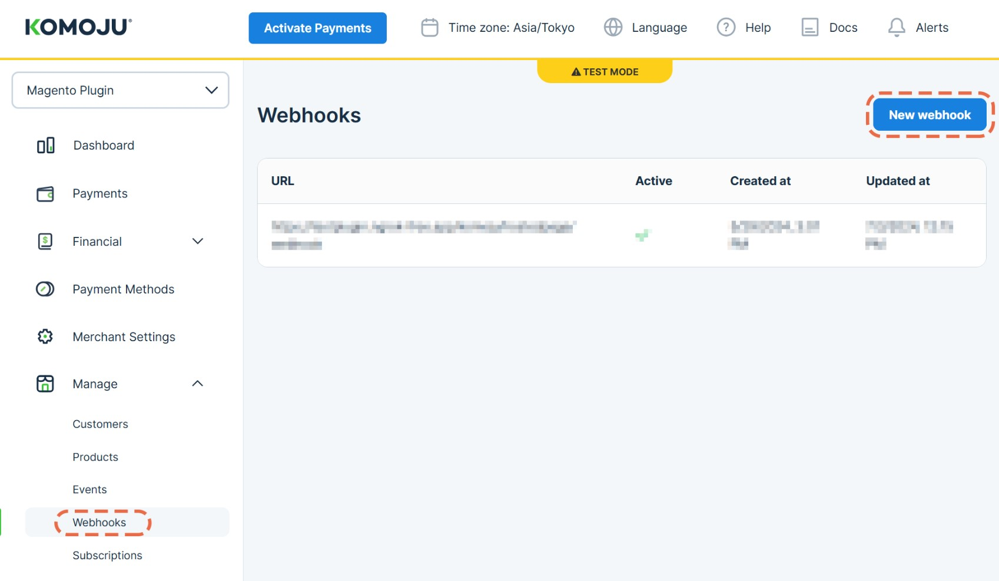

# KOMOJU-Magento プラグイン クイックスタートガイド

Magentoストアを**KOMOJU**と連携し、日本の決済方法を簡単に導入しましょう。始める前に、以下のアカウントを準備してください。

- [Adobe Commerce (Magento) アカウント](https://business.adobe.com/products/magento/magento-commerce.html)
- [KOMOJU アカウント](https://komoju.com/)

---

## 📌 インストール手順

### モジュールの手動インストール

1. **最新バージョンをダウンロード**  
   [GitHubリリースページ](https://github.com/degica/komoju-magento/releases)から最新のモジュールを取得します。
2. **ファイルをMagentoサーバーにアップロード**  
3. **ダウンロードしたファイルを `$MAGENTO_INSTALL/app/code` ディレクトリに解凍**  

    ```bash
    unzip komoju-magento-release.zip -d $MAGENTO_INSTALL/src/app/code
    ```

    *(`$MAGENTO_INSTALL` を実際のMagentoのインストールパスに置き換えてください。)*

4. **モジュールをインストール**  

    ```bash
    php bin/magento setup:upgrade
    php bin/magento setup:di:compile
    php bin/magento cache:flush
    php bin/magento setup:static-content:deploy
    ```

---

## 📌 プラグインの設定

インストール後、Magentoの管理画面で設定を行います。

1. **管理画面で以下のパスに移動**  
   **Stores** > **Sales** > **Payment Methods** > **KOMOJU** > **API設定**

2. **[KOMOJUマーチャント設定ページ](https://komoju.com/admin/merchant_settings) にあるアカウント情報を入力**


### API設定
- **マーチャントUUID**: あなたのUUID  
- **シークレットキー**: シークレットキー  
- **公開キー**: 公開キー  
- **Webhookシークレット**: (*下記の*KOMOJU Webhookの設定*を参照*)


---

## 📌 KOMOJU Webhookの設定

1. **[KOMOJUダッシュボードのWebhookページ](https://komoju.com/merchant/webhooks) にアクセスし、**「新しいWebhookを作成」**をクリック**

2. Webhookを設定します。

    `<your-magento-domain>/komoju/hostedpage/webhook`

    *(`<your-magento-domain>` を実際のストアのドメインに置き換えてください。)*

    例えば、MagentoのURLが **https://magento.komoju.com** の場合、Webhook URLは **https://magento.komoju.com/komoju/hostedpage/webhook** となります。

    

3. **シークレットを設定**し、以下のイベントを有効にします：
    - `payment.authorized`
    - `payment.captured`
    - `payment.expired`
    - `payment.cancelled`
    - `payment.refunded`
    - `payment.refund.created`

    
    

4. **Webhookを作成**し、**Webhookシークレットをコピー**
  
5. **Magentoの管理画面で**「KOMOJU」 > 「API設定」 > 「Webhookシークレット」に入力

---

## 📌 お問い合わせ

ご不明な点がございましたら、サポートチームまでお問い合わせください。  
[support@degica.com](mailto:support@degica.com)

---

*KOMOJUをご利用いただきありがとうございます。ビジネスの成長をサポートいたします！*